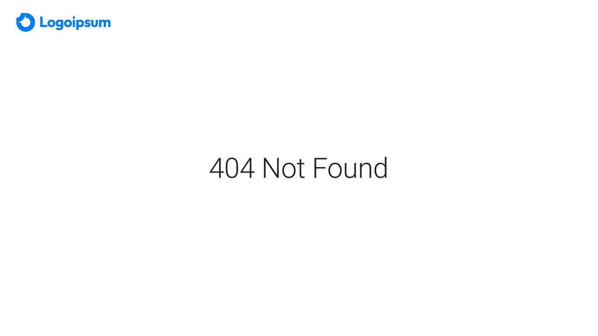

## Getting Started

- login
- dashboard
- sign up
- logout
- erd

desain figma: 
- https://www.figma.com/file/Ut0uIfEiBLpqwdrXKkiO3y/pondokkos?type=design&node-id=0%3A1&mode=design&t=ae1QYQU6VBZBnYFU-1
- https://tokyo-free-white-nextjs-js.bloomui.com/management/transactions

<!-- - login
- sign up
- dashboard - admin
- dashboard - penghuni
- dashboard - pemilik
- home - guest -->

design erd:


<details>
  <summary>Click to reveal design</summary>
  
  
  
  
  
  
  
  
  
</details>

<!-- 
First, run the development server:

```bash
npm run dev
# or
yarn dev
# or
pnpm dev
# or
bun dev
```

Open [http://localhost:3000](http://localhost:3000) with your browser to see the result.

You can start editing the page by modifying `app/page.js`. The page auto-updates as you edit the file.

This project uses [`next/font`](https://nextjs.org/docs/basic-features/font-optimization) to automatically optimize and load Inter, a custom Google Font.

## Learn More

To learn more about Next.js, take a look at the following resources:

- [Next.js Documentation](https://nextjs.org/docs) - learn about Next.js features and API.
- [Learn Next.js](https://nextjs.org/learn) - an interactive Next.js tutorial.

You can check out [the Next.js GitHub repository](https://github.com/vercel/next.js/) - your feedback and contributions are welcome!

## Deploy on Vercel

The easiest way to deploy your Next.js app is to use the [Vercel Platform](https://vercel.com/new?utm_medium=default-template&filter=next.js&utm_source=create-next-app&utm_campaign=create-next-app-readme) from the creators of Next.js.

Check out our [Next.js deployment documentation](https://nextjs.org/docs/deployment) for more details. -->
